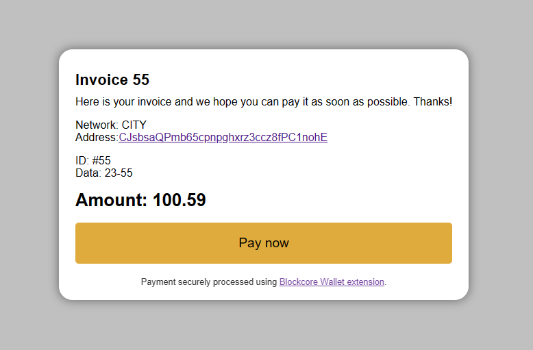

# Blockcore Widget

Interactive payment widget for Blockcore chains.



## Usage

You can either manually add attributes needed for the widget, or render using a serverside or clientside runtime.

```html
<script src="https://unpkg.com/@blockcore/widget/blockcore-widget.mjs"></script>

<blockcore-widget></blockcore-widget>
```

The above is the initial setup, but you need to configure network, amount, etc. There are no default values.

```
    <blockcore-widget
      network="CITY"
      amount="10.5"
      address="Ccoquhaae7u6ASqQ5BiYueASz8EavUXrKn"
      message="Invoice Number 5"
      label="Your Royal Highness"
      data="MzExMzUzNDIzNDY"
      reference="4324"
    ></blockcore-widget>
```

You can change the attribute on-the-fly using JavaScript:

```
<script>
const widget = document.querySelector("blockcore-widget");
const urlParams = new URLSearchParams(window.location.search);
widget.amount = urlParams.get("amount") ?? "0";
</script>
```

### Styling

You can override the default styling by either creating classes that overrides the built-in classes (e.g. `.blockcore-widget-amount`), or you can use CSS variables.

```css
html {
  --foreground: black;
  --background: white;
  --accent: #dfab3c;

  --radius: 20px;
  --depth: 15px;
}
```

These can also be applied directly on the widget, if you want it to have separate color schemes than rest of website.
